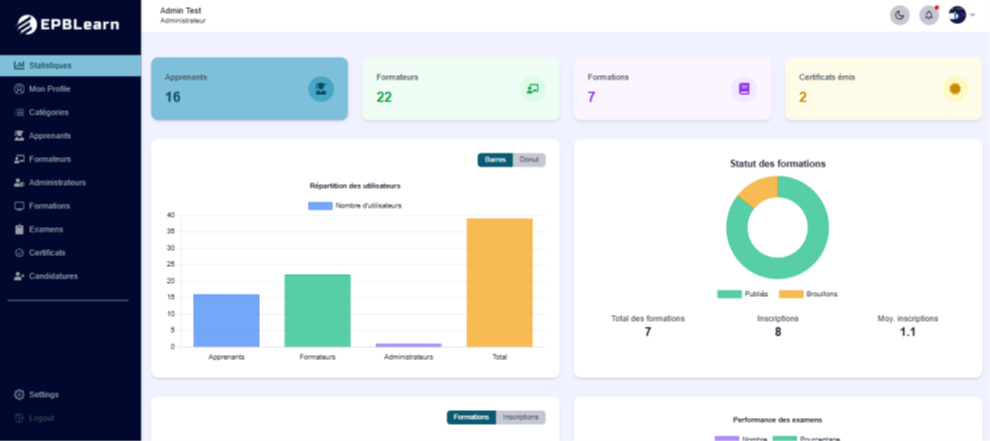

# 🎓 Plateforme de Formation en Ligne (LMS)

Une **plateforme de formation en ligne** développée avec le **MERN stack** (MongoDB, Express.js, React avec Vite, Node.js), **Tailwind CSS** pour le design, et **Cloudinary** pour la gestion des médias.  
Elle permet la gestion complète des utilisateurs, formations, examens, certificats et offre des fonctionnalités interactives comme les cours en direct, forums et chatbot.

---

## 🛠️ Fonctionnalités principales

- Authentification & gestion des rôles (Admin, Formateur, Apprenant)  
- Gestion des utilisateurs (CRUD, activation/désactivation)  
- Consultation et modification de profil  
- Création, gestion et publication de formations  
- Gestion des examens et passage par les apprenants  
- Inscription aux formations et suivi du contenu  
- Téléchargement des ressources pédagogiques (PDF, slides, images)  
- Gestion et réception des certificats  
- Gestion des candidatures pour devenir formateur  
- Statistiques et rapports détaillés  
- Cours en direct avec participation en temps réel  
- Notifications et alertes système  
- Forums et discussions  
- Chatbot / Assistant virtuel 24/7  
- Gestion des réclamations  

---

## 🏗️ Technologies utilisées

| Partie | Technologie | Rôle |
|--------|------------|------|
| Backend | Node.js + Express.js | Serveur et API REST |
| Frontend | React.js + Vite | Interface utilisateur rapide et réactive |
| Base de données | MongoDB | Stockage des données NoSQL |
| Design | Tailwind CSS | UI moderne et responsive |
| Médias | Cloudinary | Gestion des images et vidéos |
| Auth & Sécurité | JWT | Authentification sécurisée |
| Temps réel | Socket.IO | Chat et cours en direct |

---

## 📦 Installation & exécution

### Prérequis
- Node.js & npm installés  
- MongoDB en fonctionnement  
- Compte Cloudinary pour la gestion des médias  

### 1️⃣ Cloner le projet
```bash
git clone https://github.com/ton-pseudo/nom-du-projet.git

### 2️⃣Backend
cd backend
npm install

•	Crée un fichier .env :

MONGO_URI=<ton_mongodb_uri>
CLOUDINARY_CLOUD_NAME=<nom_cloud>
CLOUDINARY_API_KEY=<clé_api>
CLOUDINARY_API_SECRET=<secret>
JWT_SECRET=<ton_secret_jwt>

•	Lancer le backend :
npm start
###3️⃣ Frontend (Vite)
cd ../frontend
npm install
npm run dev
•	Accéder à l’application → l’adresse indiquée par Vite (souvent http://localhost:5173)
```

---
## 📸 Captures d’écran

### Dashboard

